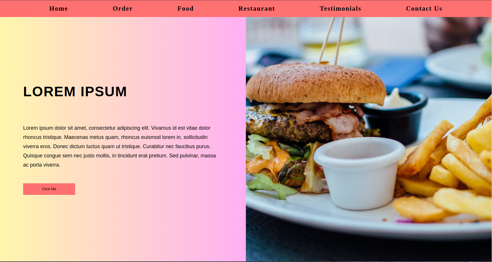
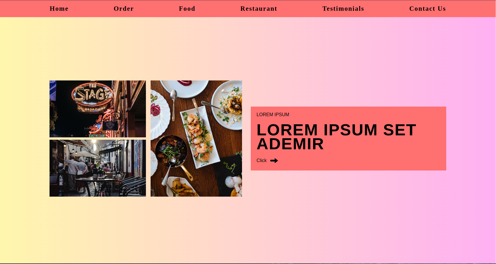
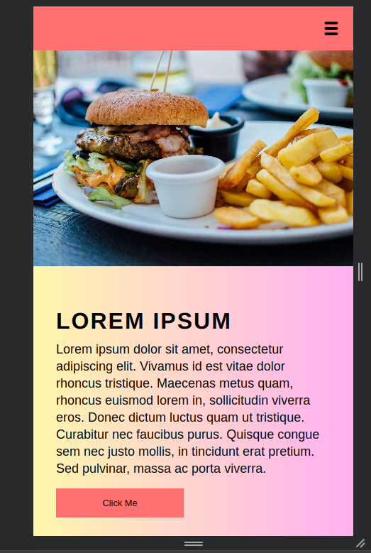
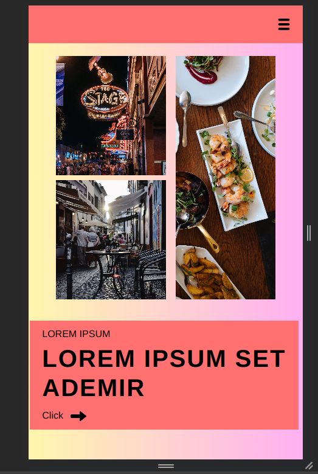

# Food-Web-App

This is a simple web application showcasing various food-related content. The project demonstrates HTML, CSS, and responsive design techniques.

## Deployment

This project is deployed using netlify. The live demo can be accessed [DEMO](https://orderfood-web.netlify.app/).

## Description

The Food-Web-App is a static web application showcasing different sections related to food, including a main section with a header, image, and content, as well as a secondary section displaying multiple images and content.

## Features

- Responsive design for various screen sizes (desktop, tablets, mobiles)
- Sections for showcasing food-related content
- Navigation bar with links to different sections

## Screenshots

## Usage

1. Clone this repository.
2. Open the `index.html` file in a web browser to view the website locally.
3. Explore different sections and checkout code.

## Deployment

This project is deployed using netlify. The live demo can be accessed [here](https://orderfood-web.netlify.app/).

<<<<<<<<<<<<<<<<<<<<<<<>>>>>>>>>>>>>>>>>>>>>>>
